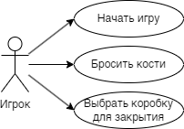

# Лабораторная работа №1
**14. Игра в кости "Закрой сектор"**

Диаграмма прецедентов:

---
## Прецедент "Начало игры"
**Описание**: Игрок готовит игровое поле, размещая лист с пронумерованными коробками и фишками для закрытия номеров.
- **Основной исполнитель**: Игрок
- **Предусловие**: Игроки собраны и готовы начать игру.
- **Постусловие**: Игровое поле готово, и первый игрок готов сделать бросок костей.

### Основной успешный сценарий:
| Пользователь         | Система                                           | 
|----------------------|---------------------------------------------------|
| 1. Собирает игроков. |                                                   | 
| 2. Готовит лист и фишки. |                                                 | 
| 3. Бросает кости.    |                                                   |
|                      | 4. Определяет результат броска и начало игры.     |

### Альтернативный сценарий "Неправильная подготовка":
| Пользователь                                  | Система                                     | 
|-----------------------------------------------|---------------------------------------------|
| 1. Забывает пронумеровать коробки.           |                                             | 
|                                               | 2. Указывает на ошибку и просит переготовить лист. |

---
## Прецедент "Бросок костей"
**Описание**: Игрок бросает две игральные кости для начала своего хода.
- **Основной исполнитель**: Игрок
- **Предусловие**: Поле готово, и игрок готов сделать бросок.
- **Постусловие**: Выпавший результат определен, и игрок знает, какие номера он может закрыть.

### Основной успешный сценарий:
| Пользователь         | Система                                           | 
|----------------------|---------------------------------------------------|
| 1. Бросает кости.    |                                                   | 
|                      | 2. Определяет выпавшую комбинацию.                |
|                      | 3. Информирует игрока о возможных номерах для закрытия. |

### Альтернативный сценарий "Кости упали со стола":
| Пользователь         | Система                                           | 
|----------------------|---------------------------------------------------|
| 1. Кости упали со стола при броске. |                                    | 
|                      | 2. Просит повторить бросок костей.                |

---
## Прецедент "Выбор коробок для закрытия"
**Описание**: Игрок выбирает номера для закрытия, соответствующие сумме очков на костях.
- **Основной исполнитель**: Игрок
- **Предусловие**: Бросок костей выполнен, и комбинация чисел известна.
- **Постусловие**: Выбранные коробки закрыты.

### Основной успешный сценарий:
| Пользователь                         | Система                             | 
|--------------------------------------|-------------------------------------|
| 1. Выбирает коробки для закрытия.    |                                     | 
|                                      | 2. Подтверждает закрытие коробок.   |

### Альтернативный сценарий "Выбраны уже закрытые номера":
| Пользователь                            | Система                                   | 
|-----------------------------------------|-------------------------------------------|
| 1. Пытается закрыть уже закрытые номера. |                                           | 
|                                         | 2. Сообщает игроку о невозможности закрыть эти номера. |
|                                         | 3. Предлагает выбрать другие номера.                   |

---
## Прецедент "Подсчет штрафных очков"
**Описание**: По окончании хода игрока, неспособного закрыть номера, подсчитываются штрафные очки за оставшиеся открытые коробки.
- **Основной исполнитель**: Игрок
- **Предусловие**: Игрок закончил ход, не закрыв все возможные номера.
- **Постусловие**: Штрафные очки добавлены к счету игрока.

### Основной успешный сценарий:
| Пользователь                    | Система                                               | 
|---------------------------------|-------------------------------------------------------|
| 1. Заканчивает ход.             |                                                       | 
|                                 | 2. Подсчитывает оставшиеся открытые номера.           |
|                                 | 3. Записывает штрафные очки в счет игрока.            |

### Альтернативный сценарий "Все номера закрыты":
| Пользователь                        | Система                                    | 
|-------------------------------------|--------------------------------------------|
| 1. Игрок закрыл все номера.         |                                            | 
|                                     | 2. Объявляет игрока победителем раунда.    |

---
## Прецедент "Смена игрока"
**Описание**: Передача хода следующему игроку после завершения хода текущего игрока.
- **Основной исполнитель**: Игровая система
- **Предусловие**: Игрок закончил ход.
- **Постусловие**: Следующий игрок готов сделать бросок костей.

### Основной успешный сценарий:
| Пользователь                | Система                                     | 
|-----------------------------|---------------------------------------------|
|                             | 1. Заканчивает ход текущего игрока.         | 
|                             | 2. Передает ход следующему игроку.          |

### Альтернативный сценарий "Игрок победил":
| Пользователь                | Система                                      | 
|-----------------------------|----------------------------------------------|
|                             | 1. Игрок закрыл все номера.                  | 
|                             | 2. Игра заканчивается, объявляется победитель. |
