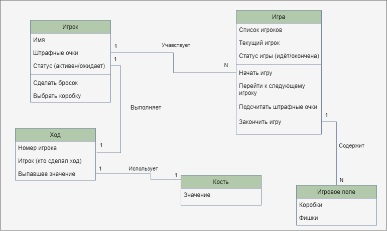

# Лабораторная работа №2

### Диаграмма классов:

## 1. Игра начинается
При запуске игры создается экземпляр класса Игра, который содержит список игроков, игровое поле и другую необходимую информацию о текущем состоянии игры.
Игроки вводят свои имена, их настройки игры сохраняются (режим игры, количество очков для победы).
Создаются игровое поле и экземпляры игроков с их параметрами (именем, штрафными очками и т.д.).

## 2. Игровой цикл
Первый игрок начинает ход с броска костей. Создается экземпляр класса Ход, который связывается с текущим игроком и игрой.
Случайное значение, выпавшее на кости, используется для выбора коробок для закрытия. Игрок выбирает коробки, соответствующие результату броска костей.
После завершения хода система подсчитывает штрафные очки, если игрок не смог закрыть все возможные номера. Этот процесс обрабатывается методом "подсчитатьШтрафныеОчки()" класса Игрок.
После завершения хода система передает ход следующему игроку. Это реализуется методом перейтиКСледующемуИгроку() класса Игра.

## 3. Завершение игры
Игра продолжается до тех пор, пока не будет достигнуто условие победы (например, один из игроков закроет все номера на игровом поле или достигнет определенного количества очков).
После завершения игры система объявляет победителя и выводит результаты.

## 4. Дополнительные функции
В процессе игры игроки могут совершать различные действия, такие как выбор коробок для закрытия или бросок костей. Эти действия реализуются соответствующими методами класса Игрок.
В классе Игра могут быть реализованы дополнительные методы для управления игрой, такие как начало, завершение и организация ходов.

### Дополнительно
- Множественность указывает на количество экземпляров классов, связанных друг с другом.
- Взаимосвязи между классами отображены с использованием ассоциаций и композиции.
