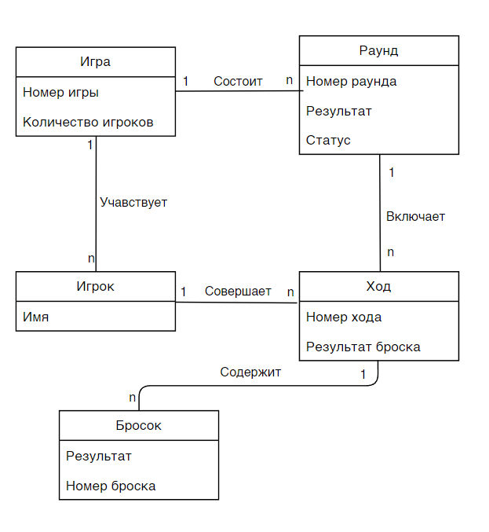

### Диаграмма классов

#### Классы и их атрибуты:

1.  Игрок

    -   Имя: Строка - представляет имя игрока.
2.  Игра

    -   Номер игры: Целое число - уникальный номер игры, генерируется автоматически.
    -   Количество игроков: Целое число - количество игроков в игре.
3.  Раунд

    -   Номер раунда: Целое число - уникальный номер раунда в рамках игры.
    -   Результат: Строка или массив результатов раунда.
    -   Статус: Строка - текущий статус раунда (например, "активен" или "завершен").
4.  Ход

    -   Номер хода: Целое число - уникальный номер хода в рамках раунда.
5.  Бросок

    -   Результат: Число - результат броска (например, сумма значений на игральных костях).
    -   Номер броска: Целое число - порядковый номер броска в рамках хода.

#### Связи:

1.  Игрок - Игра (N-1) Участвует:

    -   Каждый игрок может участвовать только в одной игре, но в игре может быть несколько игроков.
2.  Игра - Раунд (1-N) Состоит:

    -   В одной игре может быть несколько раундов, но каждый раунд принадлежит только одной игре.
3.  Раунд - Ход (1-N) Включает:

    -   В каждом раунде может быть несколько ходов, но каждый ход принадлежит только одному раунду.
4.  Игрок - Ход (1-N) Совершает:

    -   Каждый игрок совершает несколько ходов, но каждый ход совершается только одним игроком.
5.  Ход - Бросок (1-N) Содержит:

    -   В каждом ходе может быть несколько бросков, но каждый бросок принадлежит только одному ходу.